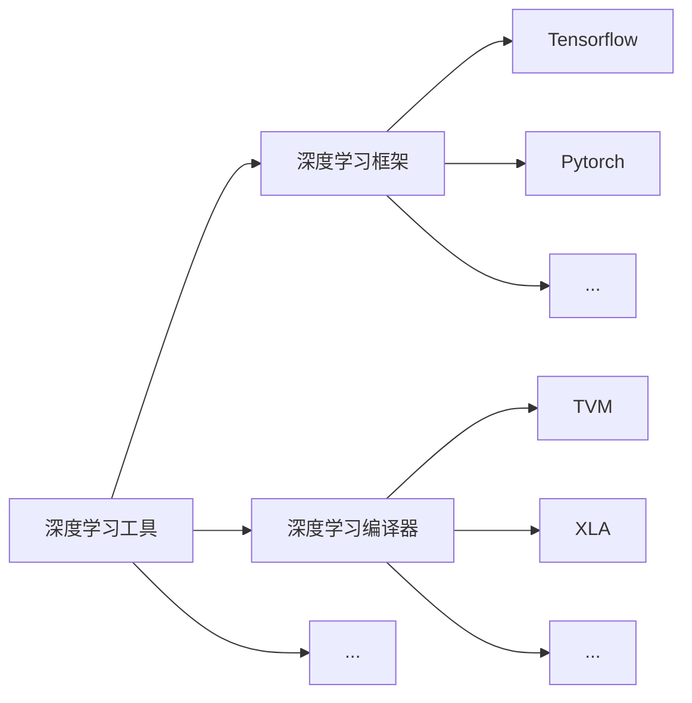

---
# try also 'default' to start simple
theme: default
# random image from a curated Unsplash collection by Anthony
# like them? see https://unsplash.com/collections/94734566/slidev
background: https://source.unsplash.com/collection/94734566/1920x1080
# apply any windi css classes to the current slide
class: 'text-center'
# https://sli.dev/custom/highlighters.html
highlighter: shiki
# show line numbers in code blocks
lineNumbers: false
# some information about the slides, markdown enabled
info: |
  ## Slidev Starter Template
  Presentation slides for developers.

  Learn more at [Sli.dev](https://sli.dev)
# persist drawings in exports and build
drawings:
  persist: false
---

# 整数线性规划问题（ILP）及其在深度学习编译器中的运用

汇报人： 罗翔 指导老师： 尚笠教授

<div class="abs-br m-6 flex gap-2">
  <button @click="$slidev.nav.openInEditor()" title="Open in Editor" class="text-xl icon-btn opacity-50 !border-none !hover:text-white">
    <carbon:edit />
  </button>
  <a href="https://github.com/slidevjs/slidev" target="_blank" alt="GitHub"
    class="text-xl icon-btn opacity-50 !border-none !hover:text-white">
    <carbon-logo-github />
  </a>
</div>

<!--
The last comment block of each slide will be treated as slide notes. It will be visible and editable in Presenter Mode along with the slide. [Read more in the docs](https://sli.dev/guide/syntax.html#notes)
-->

---

<style>
  li {
    font-size: 30px;
    margin: 15px 0;
  }
</style>

<Space />

- 深度学习编译器（Deep learning compiler）

- 多面体模型（Polyhedral model）

- 整数线性规划问题（Integer linear programming）

<!--
因为很多同学对深度学习编译器一点概念都没有，所以首先介绍一下它是什么？

接着介绍多面体模型。多面体模型不是一个新鲜事物，而是编译器一个研究了几十年领域，主要处理的对象是嵌套循环，通过将嵌套循环映射到抽象的多维约束空间，然后进行仿射变换来实现对循环的变换以更好地利用代码的局部性和现代硬件的并行能力。这里主要讲作为深度学习编译器中的一个 pass，当面对一个多层嵌套循环时，多面体模型会做些什么。我们后面会讲它会将编译过程中的调度问题（简单一点来讲就是分块问题）表示成了整数线性规划问题。

第三部分就是面对一个整数线性规划问题，如何得到一个最优解。
-->

---
layout: two-cols
---

<br>



::right::

<br>

<v-click>

深度学习框架：为深度学习开发者提供搭建深度学习模型时常用的功能模块（卷积层、池化层、激活函数等）并进行模型训练与验证。

</v-click>

<v-click>


</v-click>

<!--
当大家听到深度学习编译器的时候，可能有疑问它和我们平时用到的 Tensorflow、Pytorch 是啥关系。

为什么还需要深度学习编译器呢？大家回想一下，我们平时用 pytorch、tensorflow 写的模型是可以简单配置一下就在服务器的 GPU 上运行的，但是我们都没有写与 GPU 交互的代码，那这部分代码是谁写的呢？答案是 NVIDIA 已经为硬件写好了配套库函数，NVIDIA 推出的 cuDNN（CUDA Deep Neural Network library），cuBLAS（Basic Linear Algebra Subprograms） 这种深度学习库可以直接将常用的功能模块（算子）翻译成经过 cuda 自己的工程师调优过的 cuda 实现，框架在跑这部分代码的时候就直接调用这部分 cuDNN 中的对应代码就可以了。
-->

---
layout: two-cols
---

<br>


::right::

<br>

深度学习框架：为深度学习开发者提供搭建深度学习模型时常用的功能模块（卷积层、池化层、激活函数等）并进行模型训练与验证。

<Space />


<!--
但是这种深度学习框架采用的传统的人工优化算子的方式终究是有局限的，它需要工程师根据算子的特性和硬件的特性做专门的优化，也就是每多出一个硬件就需要有工程师把这些库移植到新的硬件上去。那现在已经出了很多新的硬件了，比如 FPGA、谷歌的 TPU、寒武纪的 Cambricon、华为的昇腾，这需要很大的工程量。因此这个时候就需要深度学习编译器，它可以利用一些方法在状态空间中针对某一个算子自动找到接近甚至超越人工的优化实现。即使单个算子通过深度学习编译器不能达到最优，但是编译器可以通过将不同算子放在一起来优化，一定可以获得一个全局更优的结果。

用陈天奇的一句话来讲“通过（接近无限）的算力去适配每一个应用场景看到的网络”。
-->

---


深度学习编译器 TVM 编译流程

- 从前端导入模型到 TVM，TVM 目前支持 Tensorflow、Pytorch、Caffe/Caffe2、PaddlePaddle、MXNet 等框架

- 将导入的模型用 TVM 内部的中间表示（IR）Relay 表示成计算图的形式，进行图优化：算子融合，数据布局重排等。

- 完成 high-level 的优化后，Relay 会通过 FuseOps pass 将原来的计算图划分为一个个子图，然后将子图表示为 Tensor Expression 的形式。TE 提供了一些调度过程（scheduling）中循环优化相关的源语包括分块（tiling）、向量化（vectorization）、并行化（parallelization）、循环展开（unrolling）与合并（fusion）等用以指导 low-level 的优化。

- 用机器学习方法为每一个子图在状态空间中搜索最优的调度方式，例如分块大小、循环展开系数等。

- 获取上一阶段为每一个子图搜索（自动调优）得到的最优调度方式。

<!--
我们刚刚说深度学习编译器是作为替代写深度学习高性能库的工程师们的一种工具，但深度学习库到底在做什么可能还是不很直观，我这里就拿了一张 TVM 的简化编译流程图。
-->

---


深度学习编译器 TVM 编译流程

- 将每一个基于 TE 表示的子图转换为 Tensor Intermediate Representation (TIR) 形式，在 TIR 上再做一些低层的优化。

- 最后把 TIR 形式转换成目标编译器接受的形式进行编译，例如 LLVM、NVCC（CUDA） 等。

<v-click>


</v-click>

<!--
balabala 重复一遍，我们以 TVM 为例大致梳理了一下深度学习编译器在干什么，我们可以发现现在整个流程仍然不是自动化的。那么什么是自动化呢？也就是给定一个模型给 TVM，我们不能直接点击 run 来完成整个编译流程，因为在第三步的时候需要我们设置 schedule primitives，那么近期华为发表的 AKG 就是针对这一步引入了多面体模型来完成了 schedule 的自动化。
-->

---

<br>

## 多面体模型（Polyhedral method）

多面体编译技术是指在循环边界约束条件下将语句实例表示成空间多面体,并通过这些多面体上的几何操作来分析和优化程序的编译技术

```c
for (int i = 1; i <= 4; i++) {
  a[i] = f(i); // S1
  for (int j = 1; j <= i; j++) {
    b[i][j] = g(a[i]); // S2
  }
}
```

```
Domain = {S1(i): 1 <= i <= 4;
          S2(i, j): 1 <= i <= 4 && 1 <= j <= i}
Dependence = {S1(i) -> S2(i, j): 1 <= i <= 4 && 
              1 <= j <= i}
```


<!--
对应多面体表示，横坐标是 j，纵坐标是 i，每一个点对应语句实例。迭代空间（domain），依赖关系

那么我们现在引入多面体模型，将循环抽象成多面体，到底是想做什么呢？
-->

---

```c
for (int i = 1; i <= m; i++) {
  for (int j = 1; j <= n; j++) {
    a[i][j] = a[i][j] + b[j]; // S1
  }
}
```

<v-click>

```c
for (int k = 0; k < n / 2; k++) {
  for (int i = 1; i <= m; i++) {
    for (int j = 1; j <= 2; j++) {
      a[i][j] = a[i][j] + b[2 * k + j]; // S1
    }
  }
}
```

</v-click>

<v-click>

```c
parfor (int k = 0; k < n / 2; k++) {
  for (int i = 1; i <= m; i++) {
    for (int j = 1; j <= 2; j++) {
      a[i][j] = a[i][j] + b[2 * k + j]; // S1
    }
  }
}
```

</v-click>


<v-click>

```c
for (int i = 1; i <= N; i++) {
  for (int j = 2; j <= N; j++) {
    a[i][j] = a[j][i] + a[i][j - 1]; // S1
  }
}
```


</v-click>

<!--
我们想做的是循环分块。分块的目的是为了利用程序的局部性以及现有硬件的并行能力。

局部性：
时间局部性
空间局部性
cache
-->

---

通过仿射变换改变坐标系，使得我们对变换后的多面体分块时，分块之间不会相互产生依赖，因此我们可以将其看作是一个原子操作。

```c
for (int i = 1; i <= N; i++) {
  for (int j = 2; j <= N; j++) {
    a[i][j] = a[j][i] + a[i][j - 1]; // S1
  }
}
```


<v-click>

对一个语句 $S_k$ 的一维仿射变换是指

$$
\phi_{S_k} = [c_1 c_2 \dots c_{m_{S_k}}](\bold{i}) + c_0 \\
$$

对一个语句 $S_k$ 的多维仿射变换是指

$$
\phi_{S_k} = \left[ \begin{array}{c} c_{11} & c_{12} & \dots & c_{1 \ m_{S_k}} \\ \dots & \dots & \dots & \dots \\ c_{K1} & c_{K2} & \dots & c_{K \ m_{S_k}} \end{array} \right] (\bold{i}) + \left[ \begin{array}{c} c_{10} \\ . \\ c_{K0} \end{array} \right]
$$

需要仿射变换矩阵列满秩

</v-click>

<!--
仿射变换就是线性组合+常数
-->

---

```c
for (int t = 0; t < T; t += 1) {
  for (int i = 1; i < N - 1; i += 1) {
    A[t + 1][i] = 0.25 * (A[t][i + 1] - 2 * A[t][i] + A[t][i - 1]); // S1
  }
}
```


<v-click>

<Space-20 />

进行如下仿射变换

$$
\phi = \phi_{S_k} = \left[ \begin{array}{c} 1 & 0 \\ 1 & 1 \end{array} \right] \left[ \begin{array}{c} t \\ i \end{array} \right] = \left[ \begin{array}{c} t \\ t + i \end{array} \right]
$$

</v-click>

<v-click>


</v-click>

---

合格的仿射变换

对所有依赖组成的集合 $R_e$ 满足：

$$
\phi_{S_j}(\bold{q}) - \phi_{S_i}(\bold{p}) \ge \bold{0}, \langle \bold{p}, \bold{q} \rangle \in R_e
$$

对于集合 $R_e$，$\bold{p} = f_e(\bold{q}), \langle \bold{p}, \bold{q} \rangle \in R_e$

$$
\delta_e(\bold{q}) = \phi_{S_j}(\bold{q}) - \phi_{S_i}(f_e(\bold{q})) \ge \bold{0}
$$

上式保证了在仿射变换后的多面体上进行分块时，分块之间的通信仅发生在分块执行前和执行后

<v-click>


</v-click>

<v-click>

$$
v(\bold{n}) = \bold{u}.\bold{n} + w
$$

使得

$$
v(\bold{n}) - \delta_e(\bold{q}) = v(\bold{n}) - (\phi_{S_j}(\bold{q}) - \phi_{S_i}(\bold{p})) \ge \bold{0}
$$

```c
for (int i = 1; i <= N; i++) {
  for (int j = 2; j <= N; j++) {
    a[i][j] = a[j][i] + a[i][j - 1]; // S1
  }
}
```

</v-click>

<!--
定义了仿射变换，使得我们对变换后的多面体分块时，分块之间不会相互产生依赖，因此我们可以将其看作是一个原子操作。

delta_e(q) 可以给出分块间通信量的一个近似估计，满足 delta_e(q) >= 0 的解有很多，需要给一个上界。
-->

---

```c
for (int i = 1; i <= N; i++) {
  for (int j = 2; j <= N; j++) {
    a[i][j] = a[j][i] + a[i][j - 1]; // S1
  }
}
```

```
P: 2 <= j <= N, 1 <= i <= N
Dependence = {S(i, j - 1) -> S(i, j): 1 <= i <= N && 2 <= j <= N;
              S(j, i) -> S(i, j): 1 <= i <= N && 2 <= j <= N && i - j >= 1}
```


<v-click>

我们假设仿射变换 $\phi = [c_i, c_j]\left[ \begin{array}{c} i \\ j \end{array} \right] + w$

对于第一个依赖 S(i, j - 1) -> S(i, j) 有

$$
c_ii + c_jj - c_ii - c_j(j - 1) \ge 0 \Rightarrow c_j \ge 0 \\
$$

其对应的上界有

$$
w - c_j \ge 0
$$

对于第二个依赖 S(j, i) -> S(i, j) 有

$$
(c_ii + c_jj) - (c_ij + c_ji) = (c_i - c_j)i + (c_j - c_i)j \ge 0, (i, j) \in (P  \wedge i - j \ge 1)
$$

</v-click>

---

$$
(c_ii + c_jj) - (c_ij + c_ji) = (c_i - c_j)i + (c_j - c_i)j \ge 0, (i, j) \in (P \wedge i - j \ge 1)
$$

Farkas 定理

令 P 为由 p 个不等式确定的一个非空多面体
$$
a_k x + b_k \ge 0, k = 1, \dots, p
$$

对于一个仿射函数 $\Psi$ 在 P 上非负当且仅当存在一组确定多面体边界的不等式的非负线性组合使得

$$
\Psi(x) \equiv \lambda_0 + \sum_{k} \lambda_k(a_kx + b_k), \lambda \ge 0
$$

运用 Farkas 定理可有

$$
(c_i - c_j)i + (c_j - c_i)j \equiv \lambda_0 + \lambda_1 (N - i) + \lambda_2 (N - j) + \lambda_3 (i - j - 1) + \lambda_4 (i - 1) + \lambda_5 (j - 2), \lambda_i \ge 0
$$

$$
c_i - c_j = -\lambda_1 + \lambda_3 + \lambda_4 \\
c_j - c_i = -\lambda_2 - \lambda_3 + \lambda_5 \\
0 = \lambda_1 + \lambda_2 \\
0 = \lambda_0 \\
\lambda_i \ge 0
$$

---

$$
c_i - c_j = -\lambda_1 + \lambda_3 + \lambda_4 \\
c_j - c_i = -\lambda_2 - \lambda_3 + \lambda_5 \\
0 = \lambda_1 + \lambda_2 \\
0 = \lambda_0 \\
\lambda_i \ge 0
$$

根据上述等式可得

$$
\lambda_0 = \lambda_1 = \lambda_2 = \lambda_4 = \lambda_5 = 0
$$

有 $c_i - c_j \ge 0$

其对应的上界有

$$
u_1N + w - (c_ii + c_jj - c_ij - c_ji) \ge 0, (i, j) \in (P \wedge i - j \ge 1)
$$

对上式同样利用 Farkas 定理可以得出

$$
u_1 \ge 0 \\
u_1 - c_i + c_j \ge 0 \\
3u_1 + w - c_i + c_j \ge 0
$$

---

我们从程序的两个依赖中得到的约束如下
$$
c_j \ge 0 \\
w - c_j \ge 0 \\
c_i - c_j \ge 0 \\ 
u_1 \ge 0 \\
u_1 - c_i + c_j \ge 0 \\
3u_1 + w - c_i + c_j \ge 0
$$

总结一下

- 分块在考虑到内存架构的前提下充分利用程序自身的局部性与现代硬件并行能力的一种优化方式。

- 但是在一些循环中因为复杂的依赖关系分块无法直接进行，需要先求出好的仿射变换，使得在放射变换后的多面体上进行分块时，分块之间的通信仅发生在分块执行前和执行后。

- 我们定义好的仿射变换需要满足的条件 $\delta_e(\bold{q}) = \phi_{S_j}(\bold{q}) - \phi_{S_i}(f_e(\bold{q})) \ge \bold{0}$，依赖在仿射变换后的坐标轴上的各分量都是沿正方向的。因为 $\delta_e(\bold{q})$ 与仿射变换后分块间的通信量正相关，因此用一个上界函数 $v(\bold{n})$ 来限制 $\delta_e(\bold{q})$。

要从上述不等式求出好的仿射变换，只需要求出 

$$
\text{minimize}_{\prec}\{ \bold{u}, \bold{w}, \bold{c} \}
$$

---

有 $\delta_e(\bold{q}) = \phi_{S_j}(\bold{q}) - \phi_{S_i}(f_e(\bold{q})) \ge \bold{0}$， $v(\bold{n}) = \bold{u}.\bold{n} + \bold{w} \ge \delta_e(\bold{q})$ 求解如下问题

$$
\text{minimize}_{\prec}\{ \bold{u}, \bold{w}, \bold{c} \}
$$

<v-click>

```c
for (int i = 1; i <= N; i++) {
  for (int j = 2; j <= N; j++) {
    a[i][j] = a[j][i] + a[i][j - 1]; // S1
  }
}
```

针对上述程序得到如下不等式
$$
c_j \ge 0 \\
w - c_j \ge 0 \\
c_i - c_j \ge 0 \\ 
u_1 \ge 0 \\
u_1 - c_i + c_j \ge 0 \\
3u_1 + w - c_i + c_j \ge 0
$$

$$
\text{minimize}_{\prec}\{ u_1, w, c_i, c_j \}
$$

</v-click>

<!--
字典序最小问题是什么含义呢

将 u 放在目标函数的最左端，因为程序中循环索引的上界往往是比较大的常数，所以首先试图最小化这些常数或符号的系数，这种方式能够保证找到最优解。试想一下如果 u = 0 ，w=0，也就是说所有的依赖在每层循环上的依赖距离分量都为 0，那么就说明这些循环嵌套中的每层循环都是可以并行的。 u 中的分量按序排列说明更侧重于外层并行，试想 u_1 = 0, u_2 \ne 0 的情况，这时第一层循环可以被并行执行，但第二层循环无法被并行执行。
-->

---

$$
c_j \ge 0 \\
w - c_j \ge 0 \\
c_i - c_j \ge 0 \\ 
u_1 \ge 0 \\
u_1 - c_i + c_j \ge 0 \\
3u_1 + w - c_i + c_j \ge 0
$$

$$
\text{minimize}_{\prec}\{ u_1, w, c_i, c_j \}
$$

<v-click>

整数字典序最小问题

$$
\text{minimize}_{\prec} \{ x_1, x_2, \dots, x_n \} \\
A\bold{x} \ge \bold{0}
$$

整数线性规划问题

$$
\text{minimize \ } \ \bold{c}^T\bold{x} \text{ \ s.t.} \\
A\bold{x} \ge \bold{0}
$$

</v-click>

---

$$
c_j \ge 0 \\
w - c_j \ge 0 \\
c_i - c_j \ge 0 \\ 
u_1 \ge 0 \\
u_1 - c_i + c_j \ge 0 \\
3u_1 + w - c_i + c_j \ge 0
$$

$$
\text{minimize}_{\prec}\{ u_1, w, c_i, c_j \}
$$

第一个解很容易得到令 $u_1 = 0$,

$$
c_i = c_j \\
w - c_j \ge 0
$$

平凡解 (0, 0, 0, 0) 无意义，仿射变换需要列满秩，因此令 $w = 1$，得 (0, 1, 1, 1)。

接下来怎么求出第二个一维仿射变换？因为列满秩，因此加入一个条件 $c_i \ne c_j$，对应两种情况 $c_i - c_j \ge 1$ 或者 $c_i - c_j \le -1$

---

先在原约束上添加 $c_i - c_j \ge 1$

$$
c_j \ge 0 \\
w - c_j \ge 0 \\
c_i - c_j \ge 0 \\ 
u_1 \ge 0 \\
u_1 - c_i + c_j \ge 0 \\
3u_1 + w - c_i + c_j \ge 0 \\
c_i - c_j \ge 1
$$

$$
\left[ \begin{array}{c}
1 & 0 & 0 & 0 \\
0 & 1 & 0 & 0 \\
0 & 0 & 1 & 0 \\
0 & 0 & 0 & 1 \\
0 & 1 & 0 & -1 \\
0 & 0 & 1 & -1 \\
1 & 0 & 0 & 0 \\
1 & 0 & -1 & 1 \\
3 & 1 & -1 & 1
\end{array} \right] 
\left[ \begin{array}{c} 
u_1 \\
w \\
c_i \\
c_j
\end{array} \right] + 
\left[ \begin{array}{c} 
0 \\
0 \\
0 \\
0 \\
0 \\
-1 \\
0 \\
0 \\
0
\end{array} \right] = 
\left[ \begin{array}{c} 
u_1 \\
w \\
c_i \\
c_j \\
z_1 \\
z_2 \\
z_3 \\
z_4 \\
z_5
\end{array} \right]
\ge \bold{0}
$$

---

$$
\left[ \begin{array}{cccc|c} 
1 & 0 & 0 & 0 & 0 \\
0 & 1 & 0 & 0 & 0 \\
0 & 0 & 1 & 0 & 0 \\
0 & 0 & 0 & 1 & 0 \\
0 & 1 & 0 & -1 & 0 \\
0 & 0 & 1 & -1 & -1 \\
1 & 0 & 0 & 0 & 0 \\
1 & 0 & -1 & 1 & 0 \\
3 & 1 & -1 & 1 & 0
\end{array} \right] \Rightarrow

\left[ \begin{array}{cccc|c} 
1 & 0 & 0 & 0 & 0 \\
0 & 1 & 0 & 0 & 0 \\
0 & 0 & 1 & 1 & 1 \\
0 & 0 & 0 & 1 & 0 \\
0 & 1 & 0 & -1 & 0 \\
0 & 0 & 1 & 0 & 0 \\
1 & 0 & 0 & 0 & 0 \\
1 & 0 & -1 & 0 & -1 \\
3 & 1 & -1 & 0 & -1
\end{array} \right]
$$

<v-click>

第二个解 (0, 0, 1, 0)。获得两个解 (0, 1, 1, 1) 和 (0, 0, 1, 0)。

```c
for (int i = 1; i <= N; i++) {
  for (int j = 2; j <= N; j++) {
    a[i][j] = a[j][i] + a[i][j - 1]; // S1
  }
}
```

$$
\phi = \left[ \begin{array}{c} 1 & 1 \\ 1 & 0 \end{array} \right] \left[ \begin{array}{c} i \\ j \end{array} \right]
$$

</v-click>

---

```c
for (int i = 1; i <= N; i++) {
  for (int j = 2; j <= N; j++) {
    a[i][j] = a[j][i] + a[i][j - 1]; // S1
  }
}
```

$$
\phi = \left[ \begin{array}{c} 1 & 1 \\ 1 & 0 \end{array} \right] \left[ \begin{array}{c} i \\ j \end{array} \right] = \left[ \begin{array}{c} i + j \\ j \end{array} \right]
$$


<v-click>


</v-click>

<v-click>

```c
for (int ci = 3; i <= 2 * N; ci++) {
  for (int cj = 2; j <= ci - 1; j++) {
    a[ci][cj] = a[ci][N + 1 - cj] + a[ci][cj - 1]; // S1
  }
}
```

</v-click>

---

<br>

<style>
  ul {
    font-size: 30px;
  }

  li {
    font-size: 26px;
    margin: 15px 0;
  }

  li.transparent {
    color: #9ea7b3de
  }
</style>

<ul>
  整数线性规划问题（Integer linear programming）
  <li>单纯形算法（Simplex method）</li>


  <li class="transparent">整数单纯形算法（Simplex method + Gomory cut）</li>
  
  <li class="transparent">字典序最小问题（Lexicographical minimum）</li>

  <li class="transparent">整数字典序最小问题（Lexicographical minimum + Gomory cut）</li>
</ul>

---

<br>

<style>
  ul {
    font-size: 30px;
  }

  li {
    font-size: 26px;
    margin: 15px 0;
  }

  li.transparent {
    color: #9ea7b3de
  }
</style>

<ul>
  整数线性规划问题（Integer linear programming）
  <li class="transparent">单纯形算法（Simplex method）</li>


  <li>整数单纯形算法（Simplex method + Gomory cut）</li>
  
  <li class="transparent">字典序最小问题（Lexicographical minimum）</li>

  <li class="transparent">整数字典序最小问题（Lexicographical minimum + Gomory cut）</li>
</ul>

---

<br>

<style>
  ul {
    font-size: 30px;
  }

  li {
    font-size: 26px;
    margin: 15px 0;
  }

  li.transparent {
    color: #9ea7b3de
  }
</style>

<ul>
  整数线性规划问题（Integer linear programming）
  <li class="transparent">单纯形算法（Simplex method）</li>


  <li class="transparent">整数单纯形算法（Simplex method + Gomory cut）</li>
  
  <li>字典序最小问题（Lexicographical minimum）</li>

  <li class="transparent">整数字典序最小问题（Lexicographical minimum + Gomory cut）</li>
</ul>

---
layout: two-cols
---

# 问题定义

<br>

$R^n$ 上的字典序最小解：给定 m $\times$ n 的矩阵 M，m 维的向量 $\bold{v}$

令 $\bold{F} = \{ \bold{x} | \bold{x} \ge \bold{0}, M\bold{x} + \bold{v} \ge \bold{0}, \bold{x} \in R^n \}$

集合 $\bold{F}$ 为问题的可行域，判定集合 $\bold{F}$ 是否为空，若不为空则求出集合中字典序最小的元素。

::right::


$\bold{F} = \{ (x_1, x_2, x_3) | x_i \ge 0, x_1 + x_2 + x_3 = 1 \}$

<br>

---

<br>

原可行域：

$$\bold{F} = \{ \bold{x} | \bold{x} \ge \bold{0}, M\bold{x} + \bold{v} \ge \bold{0}\}$$

对 $\bold{x}$ 作线性变换，引入 n $\times$ n 的矩阵 P，n 维的向量 $\bold{u}$

$$\bold{x} = P\bold{y} + \bold{u}$$

新可行域：

$$
\begin{array}{c}
\bold{F^*} & = \{ P\bold{y} + \bold{u} | P\bold{y} + \bold{u} \ge \bold{0}, M(P\bold{y} + \bold{u}) + \bold{v} \ge \bold{0}\} \\

& = \{ P\bold{y} + \bold{u} | P\bold{y} + \bold{u} \ge \bold{0}, MP\bold{y} + (M \bold{u} + \bold{v}) \ge \bold{0}\}
\end{array}
$$

<v-click>

对上述形式进一步抽象

$$
\bold{F} = \{ A\bold{y} + \bold{b} | \bold{x} = A\bold{y} + \bold{b} \ge \bold{0}, \bold{z} = C\bold{y} + \bold{d} \ge \bold{0}, \red{\bold{y} \ge \bold{0}} \}
$$

上述形式同样可以表示原可行域： A 是 n 阶单位阵($I_n$)，$\bold{b}$ 是零向量($\bold{0}$)，C 是 M，$\bold{d}$ 是 $\bold{v}$

$$
\bold{F} = \{ \bold{y} | \bold{x} = \bold{y} \ge \bold{0}, \bold{z} = M\bold{y} + \bold{v} \ge \bold{0}, \red{\bold{y} \ge \bold{0}} \}
$$

</v-click>

---

<br>

现有如下通用的可行域表示形式

$$
\bold{F} = \{ A\bold{y} + \bold{b} | \bold{x} = A\bold{y} + \bold{b} \ge \bold{0}, \bold{z} = C\bold{y} + \bold{d} \ge \bold{0}, \bold{y} \ge \bold{0} \}
$$

将其表示为矩阵形式

$$
\left[ \begin{array}{c} A \\ C \end{array} \right] \bold{y} + 
\left[ \begin{array}{c} \bold{b} \\ \bold{d} \end{array} \right]
= \left[ \begin{array}{c} \bold{x} \\ \bold{z} \end{array} \right]
$$

我们将 A 和 C 看作 (n + m) $\times$ n 矩阵 $S = \left[ \begin{array}{c} A \\ C \end{array} \right]$ 的分块矩阵，将 $\left[ \begin{array}{c} \bold{b} \\ \bold{d} \end{array} \right]$ 看作是 (m + n) 阶向量 $\bold{t}$，$\left[ \begin{array}{c} \bold{x} \\ \bold{z} \end{array} \right]$ 看作是 (m + n) 阶向量 $\bold{w}$，要求 $\bold{w} \ge \bold{0}$。

[S $\bold{t}$] = $\left[ \begin{array}{c} A & \bold{b} \\ C & \bold{d} \end{array} \right]$ 即是后续对偶单纯形算法中的单纯形表

---

<br>

当有如下矩阵形式后
$$
\left[ \begin{array}{c} A \\ C \end{array} \right] \bold{y} + 
\left[ \begin{array}{c} \bold{b} \\ \bold{d} \end{array} \right]
= \left[ \begin{array}{c} \bold{x} \\ \bold{z} \end{array} \right]
$$

那么原可行域 $\bold{F} = \{ \bold{x} | \bold{x} \ge \bold{0}, M\bold{x} + \bold{v} \ge \bold{0}\}$ 可以写成
$$
\left[ \begin{array}{c} I_n \\ M \end{array} \right] \bold{y} + 
\left[ \begin{array}{c} \bold{0} \\ \bold{v} \end{array} \right]
= \left[ \begin{array}{c} \bold{x} \\ \bold{z} \end{array} \right]
$$

初始单纯形表
$$
[S \ \bold{t}] = \left[ \begin{array}{cc} I_n & \bold{0} \\ M & \bold{v} \end{array} \right]
$$

---

<br>

初始单纯形表
$$
[S \ \bold{t}] = \left[ \begin{array}{cc} I_n & \bold{0} \\ M & \bold{v} \end{array} \right]
$$

S = [$\bold{s_1}$, ..., $\bold{s_n}$] 的列向量 $\bold{s_i}$ 都是 $[0,..., 0, s_{ij}, ...]^T$，$s_{ij} > 0$

我们称这种形式的向量为 lexico-positive，并且保证在后续对单纯形表做 pivot 操作后， S 的列向量始终保持这种性质。

<v-click>

假设我们始终保持这种性质，并且经过若干次 pivot 操作后， $\bold{t} \ge \bold{0}$，

$$
\left[ \begin{array}{c} A \\ C \end{array} \right] \bold{y} + 
\left[ \begin{array}{c} \bold{b} \\ \bold{d} \end{array} \right]
= \left[ \begin{array}{c} \bold{x} \\ \bold{z} \end{array} \right]
$$

令 $\bold{y} = \bold{0}$， $\bold{w} = \bold{t} \ge \bold{0}$，对应可行域 $\bold{F}$ 中一个元素 $\bold{x} = \bold{b}$。

</v-click>

---

现有 $\bold{t} \ge \bold{0}$，$\bold{x} = \bold{b}$ 为可行域 $\bold{F}$ 中一个元素，

$$
\left[ \begin{array}{c} A \\ C \end{array} \right] \bold{y} + 
\left[ \begin{array}{c} \bold{b} \\ \bold{d} \end{array} \right]
= \left[ \begin{array}{c} \bold{x} \\ \bold{z} \end{array} \right]
$$

证明其为可行域 $\bold{F}$ 中字典序最小的元素

$$
\begin{array}{c}
\bold{x} & = A\bold{y} + \bold{b} \\
& = \left[ \begin{array}{c} a_{11} \ a_{12} \ ... \ a_{1n} \\ a_{21} \ a_{22} \ ... \ a_{2n} \\ . \\ . \\ a_{n1} \ a_{n2} \ ... \ a_{nn} \end{array} \right] \left[ \begin{array}{c} y_1 \\ y_2 \\ . \\ . \\ y_n \end{array} \right] + \left[ \begin{array}{c} b_1 \\ b_2 \\ . \\ . \\ b_n \end{array} \right]
\end{array}
$$

因 $\red{\bold{y} \ge \bold{0}}$， 现有 $y_i = 0, 1 \le i \le n$， $\bold{y}$ 任意一维增加 $\Delta y_i > 0$， $\bold{x}$ 增加 $[a_{1i}\Delta y_i,a_{2i}\Delta y_i,...,a_{ni}\Delta y_i]^T$。

又有 $[a_{1i}, a_{2i}, ..., a_{ni}]^T, 1 \le i \le n$ 是 lexico-positive，因此 $[a_{1i}\Delta y_i,a_{2i}\Delta y_i,...,a_{ni}\Delta y_i]^T \gg \bold{0}$，

$[b_{1} + a_{1i}\Delta y_i, b_{2} + a_{2i}\Delta y_i, ..., b_{n} + a_{ni}\Delta y_i]^T \gg [b_{1}, b_{2}, ..., b_{n}]^T$，

因此 $\bold{b}$ 为 $\bold{F}$ 中字典序最小的元素。

<arrow v-click="1" x1="150" y1="355" x2="105" y2="380" color="red" width="1.5" arrowSize="1" />

<p v-after class="red absolute bottom-45 left-30 transform" style="color: red">还未说明</p>

---

$$
\left[ \begin{array}{c} A \\ C \end{array} \right] \bold{y} + 
\left[ \begin{array}{c} \bold{b} \\ \bold{d} \end{array} \right]
= \left[ \begin{array}{c} \bold{x} \\ \bold{z} \end{array} \right]
$$

对应的单纯形表

$$
\left[ \begin{array}{c|c} 
S_{11} \ \dots \ \dots \ S_{1n} & t_1 \\ 
\dots \ \dots \ \dots \ \dots \\ 
S_{n1} \ \dots \ \dots \ S_{nn} & t_n \\ 
S_{n+1 \ 1} \ \dots \ S_{n+1 \ n} & t_{n + 1} \\ 
\dots \ \dots \ \dots \ \dots \\ 
S_{m+n \ 1} \ \dots \ S_{m+n \ n} & t_{m + n} \\ 
\end{array} \right] = \left[ \begin{array}{c|c} 
a_{11} \ a_{12} \ ... \ a_{1n} & b_1 \\ 
\dots \ \dots \ \dots \ \dots \\ 
a_{n1} \ a_{n2} \ ... \ a_{nn} & b_n \\ 
c_{11} \ c_{12} \ ... \ c_{1n} & d_1 \\ 
\dots \ \dots \ \dots \ \dots \\ 
c_{m1} \ c_{m2} \ ... \ c_{mn} & d_m \\ 
\end{array} \right]
$$

选择 i 使得 $t_i < 0$，j 使得 $S_{ij} > 0$，有如下关系，其中 $w_i \ge 0$

$$
w_i = \sum_{k}S_{ik}y_k + t_i = \sum_{k \ne j}S_{ik}y_k + S_{ij}y_j + t_i
$$

将 $y_j$ 用 $y_k$($k \ne j$) 和 $w_i$ 表示

$$
y_j = \frac{w_i}{S_{ij}} - \sum_{k \ne j}\frac{S_{ik}}{S_{ij}}y_k - \frac{t_i}{S_{ij}}
$$

---

$$
\begin{array}{c}
w_m & = \sum_{k}S_{mk}y_k + t_m = \sum_{k \ne j}S_{mk}y_k + S_{mj}y_j + t_m \\
& = \sum_{k \ne j}S_{mk}y_k + S_{mj}(\frac{w_i}{S_{ij}} - \sum_{k \ne j}\frac{S_{ik}}{S_{ij}}y_k - \frac{t_i}{S_{ij}}) + t_m \\
& = \sum_{k \ne j}(S_{mk} - \frac{S_{ik}}{S_{ij}}S_{mj})y_k + \frac{S_{mj}}{S_{ij}}w_i + t_m - \frac{t_i}{S_{ij}}S_{mj}
\end{array}
$$

$$
\begin{array}{c}
w_i & = \sum_{k \ne j}(S_{ik} - \frac{S_{ik}}{S_{ij}}S_{ij})y_k + \frac{S_{ij}}{S_{ij}}w_i + t_i - \frac{t_i}{S_{ij}}S_{ij} = w_i
\end{array}
$$

$$
\left[ \begin{array}{c} w_1 \\ . \\ . \\ . \\ w_{m + n} \end{array} \right] = \left[ \begin{array}{c} 
S_{11} \ \dots \ \dots \ S_{1j} \ \dots \ \dots \ S_{1n} \\ 
\dots \ \dots \ \dots \ \dots \ \dots \ \dots \\ 
\dots \ \dots \ \dots \ \dots \ \dots \ \dots \\ 
S_{i1} \ \dots \ \dots \ S_{ij} \ \dots \ \dots \ S_{in} \\
\dots \ \dots \ \dots \ \dots \ \dots \ \dots \\ 
S_{m+n \ 1} \ \dots \ S_{m+n \ j} \ \dots \ S_{m+n \ n} \\ 
\end{array} \right]
\left[ \begin{array}{c} y_1 \\ . \\ y_j \\ . \\ . \\ y_n \end{array} \right] + \left[ \begin{array}{c} t_1 \\ . \\ . \\ t_i \\ . \\ t_{m + n} \end{array} \right] \xrightarrow[\text{$y_j$ leaves}]{\text{$w_i$ enters}} \\
\left[ \begin{array}{c} 
S_{11} - \frac{S_{i1}}{S_{ij}}S_{1j} \ \ \dots \ \dots \ \dots \ \frac{S_{1j}}{S_{ij}} \ \dots \ \dots \ \dots \ S_{1n} - \frac{S_{in}}{S_{ij}}S_{1j} \\ 
\dots \ \dots \ \dots \ \dots \ \dots \ \dots \ \dots \ \dots \ \dots \ \dots \ \dots \ \dots \\ 
\dots \ \dots \ \dots \ \dots \ \dots \ \dots \ \dots \ \dots \ \dots \ \dots \ \dots \ \dots \\ 
0 \ \dots \ \dots \ \dots \ \dots \ \dots \ 1 \ \dots \ \dots \ \dots \ \dots \ \dots \ 0 \\
\dots \ \dots \ \dots \ \dots \ \dots \ \dots \ \dots \ \dots \ \dots \ \dots \ \dots \ \dots  \\ 
S_{m+n \ 1} - \frac{S_{i \ 1}}{S_{ij}}S_{m + n \ j} \ \dots \ \dots \ \frac{S_{m + n \ j}}{S_{ij}} \ \dots \ \dots \ S_{m + n \ n} - \frac{S_{in}}{S_{ij}}S_{m + n \ j} \\ 
\end{array} \right]
\left[ \begin{array}{c} y_1 \\ . \\ \red{w_i} \\ . \\ . \\ y_n \end{array} \right] + \left[ \begin{array}{c} t_1 - \frac{t_i}{S_{ij}}S_{1j} \\ . \\ . \\ 0 \\ . \\ t_{m + n} - \frac{t_i}{S_{ij}}S_{m + n \ j} \end{array} \right]
$$

<arrow v-click="1" x1="730" y1="420" x2="705" y2="435" color="red" width="1.5" arrowSize="1" />

<p v-after class="red absolute bottom-28 right-50 transform" style="color: red">y* > 0</p>

<v-click>

<p v-after class="red absolute top-20 left-20 transform" style="color: red">(i,j)-pivot</p>

</v-click>

---

### 证明 S 的列向量在 pivot 操作后仍保持 lexico-positive 性质

因为 $S_{ij}$ 为正数，所以 $[\frac{S_{1j}}{S_{ij}}, \dots, 1, \dots, \frac{S_{m + n \ j}}{S_{ij}}]^T$ 仍然是 lexico-positive 的

要使 $[S_{1k} - \frac{S_{ik}}{S_{ij}}S_{1j}, \dots, 0, \dots, S_{m + n \ k} - \frac{S_{ik}}{S_{ij}}S_{m + n \ j}]^T$ 是 lexico-positive，需要 $[\frac{S_{1j}}{S_{ij}},\dots,\frac{S_{m+n \ j}}{S_{ij}}]^T$ 是 lexico-minimal 的。

假设做 (2, j)-pivot，需要确定 j：
$\left[ \begin{array}{c} 3 \\ 2 \\ 2 \end{array} \right] \ll \left[ \begin{array}{c} 4 \\ 4 \\ 4 \end{array} \right], \left[ \begin{array}{c} 3/2 \\ 2/2 \\ 2/2 \end{array} \right] \gg \left[ \begin{array}{c} 4/4 \\ 4/4 \\ 4/4 \end{array} \right]$

证明：

1) $S_{ik} < 0$，$S_{mk}' = S_{mk} - \frac{S_{ik}}{S_{ij}}S_{mj} = S_{mk} + \frac{|S_{ik}|}{|S_{ij}|}S_{mj}$，即一个 lexico-positive 的列向量加上另一个 lexico-positive 的列向量，因此新的列向量同样也是 lexico-positive。

2) $S_{ik} = 0$，列向量不变。

3) $S_{ik} > 0$，因为 $[\frac{S_{1k}}{S_{ik}},\dots,\frac{S_{m+n \ k}}{S_{ik}}]^T \gg [\frac{S_{1j}}{S_{ij}},\dots,\frac{S_{m+n \ j}}{S_{ij}}]^T$，考察第 k 列向量中的 $S_{ak}$，是第一个满足 $\frac{S_{ak}}{S_{ik}} > \frac{S_{aj}}{S_{ij}}$ 的元素， $S_{ak}' = S_{ak} - \frac{S_{ik}}{S_{ij}}S_{aj} = S_{ak} - \frac{S_{ik}}{S_{ij}}S_{aj} = \frac{S_{ak}S_{ij} - S_{ik}S_{aj}}{S_{ij}} > 0$，列向量仍然是 lexico-positive。

---

<br>

再来看 $\bold{t}$，$\bold{t}' = \bold{t} - \frac{t_i}{S_{ij}}s_{j}$，因为 $t_i < 0, S_{ij} > 0$，$s_{j}$ 是 lexico-positive 的，因此 $\bold{t}$ 是字典序单调递增。 $S_{1j} \ge 0$，则 $t_1' = t_1 - \frac{t_i}{S_{ij}}S_{1j}$，$t_1$ 单调递增。

回顾问题：

$$
\bold{F} = \{ A\bold{y} + \bold{b} | \bold{x} = A\bold{y} + \bold{b} \ge \bold{0}, \bold{z} = C\bold{y} + \bold{d} \ge \bold{0}, \bold{y} \ge \bold{0} \}
$$

若问题的可行域非空，则有字典序最小的解 $\bold{u} = [u_1, \dots, u_n]^T$，

$$
\sum_{j} S_{1j}y_{j} + t_1 \ge u_1 \ge t_1
$$

---

### 算法收敛性

<v-click>

面对原可行域
$$
\left[ \begin{array}{c} I_n \\ M \end{array} \right] \bold{y} + 
\left[ \begin{array}{c} \bold{0} \\ \bold{v} \end{array} \right]
= \left[ \begin{array}{c} \bold{x} \\ \bold{z} \end{array} \right]
$$
到底做了什么？

</v-click>

<v-click>

对
$$
w_i = \sum_{k}S_{ik}y_k + t_i = \sum_{k \ne j}S_{ik}y_k + S_{ij}y_j + t_i
$$

进行变换，将 $y_j$ 用 $y_k$($k \ne j$) 和 $w_i$ 表示

$$
y_j = \frac{w_i}{S_{ij}} - \sum_{k \ne j}\frac{S_{ik}}{S_{ij}}y_k - \frac{t_i}{S_{ij}}
$$

</v-click>

<v-click>

也即将原本用 $x_1, \dots, x_n$ 表示的 $\bold{w}$，一部分用 $x_1, \dots, x_n$，一部分用 $z_1, \dots, z_m$ 表示，也就是换基。只要基（basic）确定，$[S, t]$ 也确定了，基与 $\bold{t}$ 一一对应。又因为 $\bold{t}$ 单调递增，最多有 $C_{m + n}^{n}$ 个基，因此算法收敛。

</v-click>

---

求解 $R^n$ 上的可行域中字典序最小元素的算法如下：

- 根据问题约束构建初始的单纯形表
$$
[S \ \bold{t}] = \left[ \begin{array}{cc} I_n & \bold{0} \\ M & \bold{v} \end{array} \right]
$$

- 取 i 使得 $t_i < 0$，如果 $\forall i, t_i \ge 0$ 进入步骤 3

  - 取 j 使得 $S_{ij} > 0$ 且 $[\frac{S_{1j}}{S_{ij}},\dots,\frac{S_{m+n \ j}}{S_{ij}}]^T$ 字典序最小，进行 (i,j)-pivot 操作。如果 $\forall j, S_{ij} \le 0$，则有 $\sum_{j}S_{ij}y_{j} + t_i = w_i < 0$，不满足约束，原可行域为空。

- 如果当前单纯形表中仍存在 $t_i < 0$，重复步骤 2。否则令 $\bold{y} = \bold{0}$，字典序最小的元素 $\bold{x} = \bold{b}$。

---

<br>

<style>
  ul {
    font-size: 30px;
  }

  li {
    font-size: 26px;
    margin: 15px 0;
  }

  li.transparent {
    color: #9ea7b3de
  }
</style>

<ul>
  整数线性规划问题（Integer linear programming）
  <li class="transparent">单纯形算法（Simplex method）</li>


  <li class="transparent">整数单纯形算法（Simplex method + Gomory cut）</li>
  
  <li class="transparent">字典序最小问题（Lexicographical minimum）</li>

  <li>整数字典序最小问题（Lexicographical minimum + Gomory cut）</li>
</ul>

---

# 问题定义

<br>

$Z^n$ 上的字典序最小解：给定 m $\times$ n 的矩阵 M，m 维的向量 $\bold{v}$

令 $\bold{F} = \{ \bold{x} | \bold{x} \in N^n, M\bold{x} + \bold{v} \ge \bold{0} \}$

集合 $\bold{F}$ 为问题的可行域，判定集合 $\bold{F}$ 是否为空，若不为空则求出集合中字典序最小的元素。

不失一般性地，假设 M 和 $\bold{v}$ 中的元素都是整数，则 $M \bold{x} + \bold{v}$ 是整数向量。

因此原可行域抽象成

$$
\bold{F} = \{ A\bold{y} + \bold{b} | \bold{x} = A\bold{y} + \bold{b} \in N^n, \bold{z} = C\bold{y} + \bold{d} \in N^m, \red{\bold{y} \in N^n} \}
$$

<br>

---

针对可行域
$$
\bold{F} = \{ A\bold{y} + \bold{b} | \bold{x} = A\bold{y} + \bold{b} \in N^n, \bold{z} = C\bold{y} + \bold{d} \in N^m, \red{\bold{y} \in N^n} \}
$$

如果还是完全照搬上一节的算法，（算法收敛后）得到 $\bold{t} = \left[ \begin{array}{c} \bold{b} \\ \bold{d} \end{array} \right]$ 是可行域

$$
\overline{\bold{F}} = \{ A\bold{y} + \bold{b} | \bold{x} = A\bold{y} + \bold{b} \ge \bold{0}, \bold{z} = C\bold{y} + \bold{d} \ge \bold{0}, \red{\bold{y} \ge \bold{0}} \}
$$

字典序最小值，且无法保证 $\bold{b}$ 是整数。对于 $\bold{F}$ 的字典序最小值 $\bold{u}$，我们知道 $\bold{u} \in \overline{\bold{F}}$，因此有 $\bold{b} \ll \bold{u}$

<v-click>

怎么处理呢？

</v-click>

<v-click>

通过 Gomory cut 引入一个新的约束，在排除掉 $\bold{b}$ 这样的全局非整数的字典序最小解的同时，保留所有可行的整数解。

</v-click>

---

## Gomory cut

选取第一个不是整数的 $b_i$ 对应的 A 中的行，如果不存在这样的行，则 $\bold{b}$ 是整数向量，且为原可行域的整数字典序最小解。令 D 为 $S_{ij}$ 和 $b_i$ 的最小公分母，若有

$$
\sum_{j} S_{ij}y_j + t_i \in N
$$

则

$$
\sum_{j} (DS_{ij})y_j + (Dt_i) \equiv 0 \mod D
$$

对上式进行取模运算

$$
\sum_{j} ((DS_{ij}) \% D)y_j \equiv (-Dt_i) \% D \mod D
$$

进一步有

$$
\sum_{j} ((DS_{ij}) \% D)y_j = (-Dt_i) \% D + kD(k \ge 0)
$$

---

$$
\sum_{j} ((DS_{ij}) \% D)y_j = (-Dt_i) \% D + kD(k \ge 0)
$$

根据 $k \ge 0$，可以将上式写成

$$
\sum_{j} ((DS_{ij}) \% D)y_j - (-Dt_i) \% D \ge 0
$$

并且知道

$$
\sum_{j} \frac{((DS_{ij}) \% D)}{D}y_j - \frac{(-Dt_i) \% D}{D} = k
$$

是一个非负整数，因此可以加入

$$
\sum_{j} \frac{((DS_{ij}) \% D)}{D}y_j - \frac{(-Dt_i) \% D}{D} \in N
$$

作为 cut

---

针对新的约束

$$
\sum_{j} \frac{((DS_{ij}) \% D)}{D}y_j - \frac{(-Dt_i) \% D}{D} \in N
$$

其常数项为负，可以进一步 pivot。

<v-click>

我们根据

$$
\sum_{j} S_{ij}y_j + t_i \in N
$$

推导出约束将非整数的字典序最小解排除在外，但原可行域的整数可行解都保留。继续 pivot 可能发现原可行域为空，即原问题无整数字典序最小解，或者不断加入 Gomory cut 最后得到一个整数解，通过类似上一节的证明证得是整数字典序最小解。

</v-click>

---

### 算法收敛性

有原可行域
$$
\bold{F} = \{ \bold{x} | \bold{x} \in N^n, M\bold{x} + \bold{v} \in N^n \}
$$

令 $\bold{F}_n$ 为原问题加入 n 个 cut 后的可行域

$$
\bold{F}_n = \{ A^{(n)}\bold{y} + \bold{b}^{(n)} | \bold{x} = A^{(n)}\bold{y} + \bold{b}^{(n)} \in N^n, \bold{z} = C^{(n)}\bold{y} + \bold{d}^{(n)} \in N^m, \red{\bold{y} \in N^n} \}
$$

令 $\bold{F}_n^*$ 为加入第 n 个 cut 并且 pivot 之后的可行域表示形式。

---

对于新加入的一个 cut

$$
\sum_{j} \frac{((DS_{ij}) \% D)}{D}y_j - \frac{(-Dt_i) \% D}{D} \in N
$$

令 $\sigma(n)$ 为新加入的第 n 个 cut 对应的约束的行号，则第 n 个 cut 的常数项为 $-\frac{(-D^{(n)}b_{\sigma(n)}^{(n)}) \% D^{(n)}}{D^{(n)}}$，进行 pivot 时，其进行 pivot 操作时对应的 $S_{ij}$ 为 $\frac{(D^{(n)}A_{\sigma(n)j}^{(n)}) \% D^{(n)}}{D^{(n)}}$

则有

$$
b_{\sigma(n)}^{'(n)} = b_{\sigma(n)}^{(n)} + \frac{(-D^{(n)}b_{\sigma(n)}^{(n)}) \% D^{(n)}}{D^{(n)}} \frac{D^{(n)}}{(D^{(n)}A_{\sigma(n)j}^{(n)}) \% D^{(n)}} A_{\sigma(n)j}^{(n)}
$$

---

$$
b_{\sigma(n)}^{'(n)} = b_{\sigma(n)}^{(n)} + \frac{(-D^{(n)}b_{\sigma(n)}^{(n)}) \% D^{(n)}}{D^{(n)}} \frac{D^{(n)}}{(D^{(n)}A_{\sigma(n)j}^{(n)}) \% D^{(n)}} A_{\sigma(n)j}^{(n)}
$$

已知 $b_{\sigma(n)}^{(n)}$ 和 $A_{\sigma(n)j}^{(n)}$ 为正数，且有

$$
(D^{(n)}A_{\sigma(n)j}^{(n)}) \% D^{(n)} \le D^{(n)}A_{\sigma(n)j}^{(n)}
$$

可得

$$
b_{\sigma(n)}^{'(n)} \ge b_{\sigma(n)}^{(n)} + \frac{(-D^{(n)}b_{\sigma(n)}^{(n)}) \% D^{(n)}}{D^{(n)}} = \frac{b_{\sigma(n)}^{(n)}D^{(n)} + (-D^{(n)}b_{\sigma(n)}^{(n)}) \% D^{(n)}}{D^{(n)}}
$$

令 $b_{\sigma(n)}^{(n)} = q(n) - \frac{r(n)}{D^{(n)}}$，$q(n)$ 和 $r(n)$ 都是整数，且 $0 \le r(n) < D^{(n)}$，将 $b_{\sigma(n)}^{(n)}$ 带入上式有

$$
b_{\sigma(n)}^{'(n)} \ge q(n) > b_{\sigma(n)}^{(n)}
$$

因为 $\sigma(n)$ 的选取满足 $b_{\sigma(n)}^{(n)}$ 非整数，由上式可知，每次由 $\sigma(n)$-行获得新的 cut 并进行 pivot 操作后，$b_{\sigma(n)}^{'(n)}$ 和 $b_{\sigma(n)}^{(n)}$ 间必定会有一个整数 $\{b_{\sigma(n)}^{(n)}\}$

---

<style>
  li {
    font-size: 15px;
    margin: 15px 0;
  }
</style>

现在考虑 $b_1$ 所在的第一行，假设当前引入的 cut 不对应第一行，则 $b_1$ 为整数。
- 令 j 为下一个 pivot 操作对应的列，如果 $S_{1j} = 0$，则 $b_1$ pivot 过程中不变。
- 否则 $S_{1j} > 0$，$b_1$ 增加。
  - 如果增加的部分是整数，那么 $b_1$ 至少增加了 1。
  - 否则下一个 cut 的就会用到第一行，$b_1$ 还是会超过 $b_1 + 1$

我们定义一类 cut 为 1-cut，满足：

- 选取第一行来生成新的 cut
- 在做插入当前 cut 后的下一个 pivot 时，$S_{1j} > 0$，j 是做 pivot 操作时对应的列号

假设第 n 个引入的 cut 是 1-cut，则 $[b_1^{(n)}, b_1^{(n+1)}]$ 区间内至少有一个整数，$[b_1^{(i)}, b_1^{(i+1)}]$ 区间内的这些整数构成了一个严格单调递增的序列，假设前 n 个 cut 中有 $K_n$ 个 1-cut，分别为 $i_1, \dots, i_{K_n}$，则有 $1 \le i_1 < i_2 < \dots < i_{K_n} \le n$，则有

$$
b_1^{(n)} - b_1^{(0)} \ge K_n - 1
$$

---

原可行域
$$
\bold{F} = \{ \bold{x} | \bold{x} \in N^n, M\bold{x} + \bold{v} \in N^n \}
$$

$\bold{F}_n$ 为原问题加入 n 个 cut 后的可行域

$$
\bold{F}_n = \{ A^{(n)}\bold{y} + \bold{b}^{(n)} | \bold{x} = A^{(n)}\bold{y} + \bold{b}^{(n)} \in N^n, \bold{z} = C^{(n)}\bold{y} + \bold{d}^{(n)} \in N^m, \red{\bold{y} \in N^n} \}
$$

已知 $\bold{F}$ 的字典序最小解为 $\bold{u}$ 并且 $\bold{u} \in F_n$，因此存在 $\bold{y}$

$$
\bold{u} = A^{(n)}\bold{y} + \bold{b}^{(n)}, \bold{y} \ge \bold{0}
$$

因为 $A^{(n)}$ 是 lexico-positive，有 $\bold{b}^{(n)} \ll \bold{u}$，并且 $\bold{b}_1^{(n)} \le \bold{u}_1$，可知 1-cut 的数目是有限的，因此

$$
\exists N_1 \text{, s.t.} \forall n \ge N_1, b_1^{(n)} = b_1^{(N_1)}
$$

并且 $b_1^{(N_1)}$ 是整数。因此对于 $N_1$ 之后的 cut，pivot 只会在 $S_{1j} = 0$ 的列上进行。

---

对于第 i 行， $J_i^+$（$J_i^0$， $J_i^-$）对应列号 j 的集合满足 $S_{ij} > 0$（$S_{ij} = 0$，$S_{ij} < 0$），因此有

$$
\forall j \in J_1^+: 0 \le y_j \le  \frac{\bold{u}_1 - \bold{b}_1^{(N_1)}}{A_{1j}^{(N_1)}}
$$

并且对于 $N_1$ 之后的 cut，上式始终成立，因为后续的 pivot 只在 $S_{1j} = 0$ 的列上进行，因此第一行 $S_{1j}$ 后续不会变化。

考察第二行，为了保证 S 的所有列向量均是 lexico-positive，可有 $\forall j \in J_1^0: A_{2j}^{(N_1)} \ge 0$，因此 $J_2^- \subseteq J_1^+$

$$
\bold{b}_2^{(N_1)} = \bold{u}_2 - \sum_{j} A_{2j}^{(N_1)}y_j \le \bold{u}_2 + \sum_{j \in J_2^-}(-A_{2j}^{(N_1)})y_j \le \bold{u}_2 + \sum_{j \in J_2^-}(-A_{2j}^{(N_1)})\frac{\bold{u}_1 - \bold{b}_1^{(N_1)}}{A_{1j}^{(N_1)}}
$$

因此 2-cut 这一类的 cut 数量也是有限的，参照上述流程可得

$$
\exists N_2 \text{, s.t.} \forall n \ge N_2, b_2^{(n)} = b_2^{(N_2)}
$$

且 $b_2^{(N_2)}$ 为整数，依次得到 $N_1, N_2, \dots, N_n$ 用以刻画 n-cut 的数目，最终得到 $\bold{b}$ 为整数向量，算法结束。

---

求解 $Z^n$ 上的可行域中字典序最小元素的算法如下：

- 根据问题约束构建初始的单纯形表
$$
[S \ \bold{t}] = \left[ \begin{array}{cc} I_n & \bold{0} \\ M & \bold{v} \end{array} \right]
$$

- 按照 $R^n$ 上求解可行域中字典序最小元素的算法求出（非整数的）字典序最小元素

- 取 i 使得 i 为不满足 $b_i \in N$ 的最小值。如果 $\forall i, b_i \in N$ 则得到整数字典序最小解 $\bold{b}$，否则根据第 i 行对应的约束加入相应的 Gomory cut，进入步骤 2

---

# 参考文献

- 【深度学习编译器前沿综述】Mingzhen Li, Yi Liu, Xiaoyan Liu, Qingxiao Sun, Xin You, Hailong Yang, Zhongzhi Luan, Lin Gan, Guangwen Yang, and Depei Qian. The deep learning compiler: A comprehensive survey. IEEE Transactions on Parallel and Distributed Systems, 32(3):708–727, 2020. https://arxiv.org/pdf/2002.03794.pdf

- U. Bondhugula, M. Baskaran, S. Krishnamoorthy, J. Ramanujam, A. Rountev, and P. Sadayappan. Affine transformations for communication minimal parallelization and locality optimization of arbitrarily-nested loop sequences. Technical Report OSU-CISRC5/07-TR43, The Ohio State University, May 2007. https://www.ece.lsu.edu/jxr/Publications-pdf/tr43-07.pdf

- 【单纯形算法】E. K. P. Chong and S. H. Zak, An Introduction to Optimization. New York: Wiley, 2001.

- P. Feautrier. Parametric integer programming. Operationnelle/Operations Research, 22(3):243–268, 1988. http://www.numdam.org/item/RO_1988__22_3_243_0.pdf

- 赵捷 Polyhedral 编译调度算法：

  - Pluto算法 https://zhuanlan.zhihu.com/p/199683290

  - Feautrier算法 https://zhuanlan.zhihu.com/p/232070003

  - isl中的调度算法 https://zhuanlan.zhihu.com/p/259311866

---

# 参考文献

- Jie Zhao, Bojie Li, Wang Nie, Zhen Geng, Renwei Zhang, Xiong Gao, Bin Cheng, Chen Wu, Yun Cheng, Zheng Li, Peng Di, Kun Zhang, and Xuefeng Jin. 2021. AKG: automatic kernel generation for neural processing units using polyhedral transformations. In Proceedings of the 42nd ACM SIGPLAN International Conference on Programming Language Design and Implementation (PLDI 2021). Association for Computing Machinery, New York, NY, USA, 1233–1248. DOI:https://doi.org/10.1145/3453483.3454106

- 陈天奇 深度学习编译技术的现状和未来 https://zhuanlan.zhihu.com/p/65452090

- S. Chetlur, C. Woolley, P. Vandermersch, J. Cohen, J. Tran, B. Catanzaro, and E. Shelhamer. cuDNN: Efficient primitives for deep learning. arXiv preprint, 1410.0759, 2014. arxiv.org/abs/1410.0759

- 【TVM 编译优化 Pytorch】

  - 使用TVM编译优化Pytorch模型 https://bbs.huaweicloud.com/blogs/224847

  - TVM-Pytorch模型编译体验+性能测试 https://blog.csdn.net/jiangpeng59/article/details/105516970

  - Optimizing PyTorch models for fast CPU inference using Apache TVM https://spell.ml/blog/optimizing-pytorch-models-using-tvm-YI7pvREAACMAwYYz