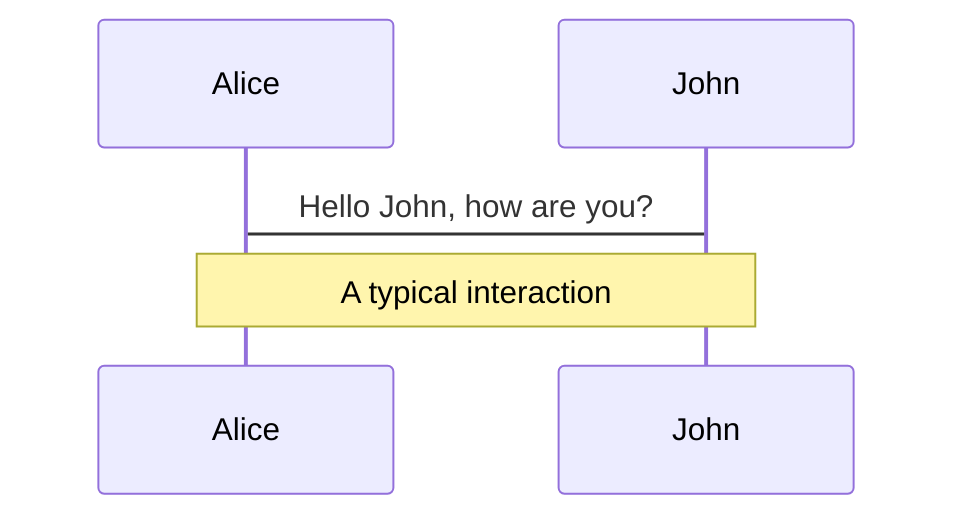
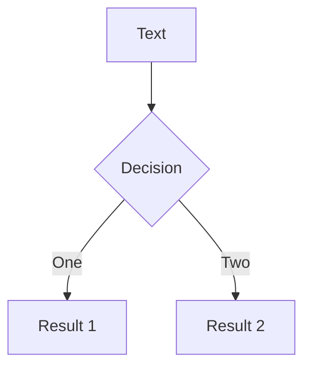

---
# try also 'default' to start simple
theme: default
# random image from a curated Unsplash collection by Anthony
# like them? see https://unsplash.com/collections/94734566/slidev
background: https://source.unsplash.com/collection/94734566/1920x1080
# apply any windi css classes to the current slide
class: 'text-center'
# https://sli.dev/custom/highlighters.html
highlighter: shiki
# show line numbers in code blocks
lineNumbers: false
# some information about the slides, markdown enabled
info: |
  ## Slidev Starter Template
  Presentation slides for developers.

  Learn more at [Sli.dev](https://sli.dev)
# persist drawings in exports and build
drawings:
  persist: false
---

# 整数线性规划问题（ILP）及其在深度学习编译器中的运用

汇报人： 罗翔 指导老师： 尚笠教授

<div class="abs-br m-6 flex gap-2">
  <button @click="$slidev.nav.openInEditor()" title="Open in Editor" class="text-xl icon-btn opacity-50 !border-none !hover:text-white">
    <carbon:edit />
  </button>
  <a href="https://github.com/slidevjs/slidev" target="_blank" alt="GitHub"
    class="text-xl icon-btn opacity-50 !border-none !hover:text-white">
    <carbon-logo-github />
  </a>
</div>

<!--
The last comment block of each slide will be treated as slide notes. It will be visible and editable in Presenter Mode along with the slide. [Read more in the docs](https://sli.dev/guide/syntax.html#notes)
-->

---

<br>

<style>
  ul {
    font-size: 30px;
  }

  li {
    font-size: 26px;
    margin: 15px 0;
  }

  li.transparent {
    color: #9ea7b3de
  }
</style>

<ul>
  整数线性规划问题（Integer linear programming）
  <li>单纯形算法（Simplex method）</li>


  <li class="transparent">整数单纯形算法（Simplex method + Gomory cut）</li>
  
  <li class="transparent">字典序最小问题（Lexicographical minimum）</li>

  <li class="transparent">整数字典序最小问题（Lexicographical minimum + Gomory cut）</li>
</ul>

---

<br>

<style>
  ul {
    font-size: 30px;
  }

  li {
    font-size: 26px;
    margin: 15px 0;
  }

  li.transparent {
    color: #9ea7b3de
  }
</style>

<ul>
  整数线性规划问题（Integer linear programming）
  <li class="transparent">单纯形算法（Simplex method）</li>


  <li>整数单纯形算法（Simplex method + Gomory cut）</li>
  
  <li class="transparent">字典序最小问题（Lexicographical minimum）</li>

  <li class="transparent">整数字典序最小问题（Lexicographical minimum + Gomory cut）</li>
</ul>

---

<br>

<style>
  ul {
    font-size: 30px;
  }

  li {
    font-size: 26px;
    margin: 15px 0;
  }

  li.transparent {
    color: #9ea7b3de
  }
</style>

<ul>
  整数线性规划问题（Integer linear programming）
  <li class="transparent">单纯形算法（Simplex method）</li>


  <li class="transparent">整数单纯形算法（Simplex method + Gomory cut）</li>
  
  <li>字典序最小问题（Lexicographical minimum）</li>

  <li class="transparent">整数字典序最小问题（Lexicographical minimum + Gomory cut）</li>
</ul>

---
layout: two-cols
---

# 问题定义

<br>

$R^n$ 上的字典序最小解：给定 m $\times$ n 的矩阵 M，m 维的向量 $\bold{v}$

令 $\bold{F} = \{ \bold{x} | \bold{x} \ge \bold{0}, M\bold{x} + \bold{v} \ge \bold{0}, \bold{x} \in R^n \}$

集合 $\bold{F}$ 为问题的可行域，判定集合 $\bold{F}$ 是否为空，若不为空则求出集合中字典序最小的元素。

::right::


$\bold{F} = \{ (x_1, x_2, x_3) | x_i \ge 0, x_1 + x_2 + x_3 = 1 \}$

<br>

---

<br>

原可行域：

$$\bold{F} = \{ \bold{x} | \bold{x} \ge \bold{0}, M\bold{x} + \bold{v} \ge \bold{0}\}$$

对 $\bold{x}$ 作线性变换，引入 n $\times$ n 的矩阵 P，n 维的向量 $\bold{u}$

$$\bold{x} = P\bold{y} + \bold{u}$$

新可行域：

$$
\begin{array}{c}
\bold{F^*} & = \{ P\bold{y} + \bold{u} | P\bold{y} + \bold{u} \ge \bold{0}, M(P\bold{y} + \bold{u}) + \bold{v} \ge \bold{0}\} \\

& = \{ P\bold{y} + \bold{u} | P\bold{y} + \bold{u} \ge \bold{0}, MP\bold{y} + (M \bold{u} + \bold{v}) \ge \bold{0}\}
\end{array}
$$

<v-click>

对上述形式进一步抽象

$$
\bold{F} = \{ A\bold{y} + \bold{b} | \bold{x} = A\bold{y} + \bold{b} \ge \bold{0}, \bold{z} = C\bold{y} + \bold{d} \ge \bold{0}, \red{\bold{y} \ge \bold{0}} \}
$$

上述形式同样可以表示原可行域： A 是 n 阶单位阵($I_n$)，$\bold{b}$ 是零向量($\bold{0}$)，C 是 M，$\bold{d}$ 是 $\bold{v}$

$$
\bold{F} = \{ \bold{y} | \bold{x} = \bold{y} \ge \bold{0}, \bold{z} = M\bold{y} + \bold{v} \ge \bold{0}, \red{\bold{y} \ge \bold{0}} \}
$$

</v-click>

---

<br>

现有如下通用的可行域表示形式

$$
\bold{F} = \{ A\bold{y} + \bold{b} | \bold{x} = A\bold{y} + \bold{b} \ge \bold{0}, \bold{z} = C\bold{y} + \bold{d} \ge \bold{0}, \bold{y} \ge \bold{0} \}
$$

将其表示为矩阵形式

$$
\left[ \begin{array}{c} A \\ C \end{array} \right] \bold{y} + 
\left[ \begin{array}{c} \bold{b} \\ \bold{d} \end{array} \right]
= \left[ \begin{array}{c} \bold{x} \\ \bold{z} \end{array} \right]
$$

我们将 A 和 C 看作 (n + m) $\times$ n 矩阵 $S = \left[ \begin{array}{c} A \\ C \end{array} \right]$ 的分块矩阵，将 $\left[ \begin{array}{c} \bold{b} \\ \bold{d} \end{array} \right]$ 看作是 (m + n) 阶向量 $\bold{t}$，$\left[ \begin{array}{c} \bold{x} \\ \bold{z} \end{array} \right]$ 看作是 (m + n) 阶向量 $\bold{w}$，要求 $\bold{w} \ge \bold{0}$。

[S $\bold{t}$] = $\left[ \begin{array}{c} A & \bold{b} \\ C & \bold{d} \end{array} \right]$ 即是后续对偶单纯形算法中的单纯形表

---

<br>

当有如下矩阵形式后
$$
\left[ \begin{array}{c} A \\ C \end{array} \right] \bold{y} + 
\left[ \begin{array}{c} \bold{b} \\ \bold{d} \end{array} \right]
= \left[ \begin{array}{c} \bold{x} \\ \bold{z} \end{array} \right]
$$

那么原可行域 $\bold{F} = \{ \bold{x} | \bold{x} \ge \bold{0}, M\bold{x} + \bold{v} \ge \bold{0}\}$ 可以写成
$$
\left[ \begin{array}{c} I_n \\ M \end{array} \right] \bold{y} + 
\left[ \begin{array}{c} \bold{0} \\ \bold{v} \end{array} \right]
= \left[ \begin{array}{c} \bold{x} \\ \bold{z} \end{array} \right]
$$

初始单纯形表
$$
[S \ \bold{t}] = \left[ \begin{array}{cc} I_n & \bold{0} \\ M & \bold{v} \end{array} \right]
$$

---

<br>

初始单纯形表
$$
[S \ \bold{t}] = \left[ \begin{array}{cc} I_n & \bold{0} \\ M & \bold{v} \end{array} \right]
$$

S = [$\bold{s_1}$, ..., $\bold{s_n}$] 的列向量 $\bold{s_i}$ 都是 $[0,..., 0, s_{ij}, ...]^T$，$s_{ij} > 0$

我们称这种形式的向量为 lexico-positive，并且保证在后续对单纯形表做 pivot 操作后， S 的列向量始终保持这种性质。

<v-click>

假设我们始终保持这种性质，并且经过若干次 pivot 操作后， $\bold{t} \ge \bold{0}$，

$$
\left[ \begin{array}{c} A \\ C \end{array} \right] \bold{y} + 
\left[ \begin{array}{c} \bold{b} \\ \bold{d} \end{array} \right]
= \left[ \begin{array}{c} \bold{x} \\ \bold{z} \end{array} \right]
$$

令 $\bold{y} = \bold{0}$， $\bold{w} = \bold{t} \ge \bold{0}$，对应可行域 $\bold{F}$ 中一个元素 $\bold{x} = \bold{b}$。

</v-click>

---

现有 $\bold{t} \ge \bold{0}$，$\bold{x} = \bold{b}$ 为可行域 $\bold{F}$ 中一个元素，

$$
\left[ \begin{array}{c} A \\ C \end{array} \right] \bold{y} + 
\left[ \begin{array}{c} \bold{b} \\ \bold{d} \end{array} \right]
= \left[ \begin{array}{c} \bold{x} \\ \bold{z} \end{array} \right]
$$

证明其为可行域 $\bold{F}$ 中字典序最小的元素

$$
\begin{array}{c}
\bold{x} & = A\bold{y} + \bold{b} \\
& = \left[ \begin{array}{c} a_{11} \ a_{12} \ ... \ a_{1n} \\ a_{21} \ a_{22} \ ... \ a_{2n} \\ . \\ . \\ a_{n1} \ a_{n2} \ ... \ a_{nn} \end{array} \right] \left[ \begin{array}{c} y_1 \\ y_2 \\ . \\ . \\ y_n \end{array} \right] + \left[ \begin{array}{c} b_1 \\ b_2 \\ . \\ . \\ b_n \end{array} \right]
\end{array}
$$

因 $\red{\bold{y} \ge \bold{0}}$， 现有 $y_i = 0, 1 \le i \le n$， $\bold{y}$ 任意一维增加 $\Delta y_i > 0$， $\bold{x}$ 增加 $[a_{1i}\Delta y_i,a_{2i}\Delta y_i,...,a_{ni}\Delta y_i]^T$。

又有 $[a_{1i}, a_{2i}, ..., a_{ni}]^T, 1 \le i \le n$ 是 lexico-positive，因此 $[a_{1i}\Delta y_i,a_{2i}\Delta y_i,...,a_{ni}\Delta y_i]^T \gg \bold{0}$，

$[a_{1i} + a_{1i}\Delta y_i, a_{2i} + a_{2i}\Delta y_i, ..., a_{ni} + a_{ni}\Delta y_i]^T \gg [a_{1i}, a_{2i}, ..., a_{ni}]^T$，

因此 $\bold{b}$ 为 $\bold{F}$ 中字典序最小的元素。

<arrow v-click="1" x1="150" y1="355" x2="105" y2="380" color="red" width="1.5" arrowSize="1" />

<p v-after class="red absolute bottom-45 left-30 transform" style="color: red">还未说明</p>

---

$$
\left[ \begin{array}{c} A \\ C \end{array} \right] \bold{y} + 
\left[ \begin{array}{c} \bold{b} \\ \bold{d} \end{array} \right]
= \left[ \begin{array}{c} \bold{x} \\ \bold{z} \end{array} \right]
$$

对应的单纯形表

$$
\left[ \begin{array}{c|c} 
S_{11} \ \dots \ \dots \ S_{1n} & t_1 \\ 
\dots \ \dots \ \dots \ \dots \\ 
S_{n1} \ \dots \ \dots \ S_{nn} & t_n \\ 
S_{n+1 \ 1} \ \dots \ S_{n+1 \ n} & t_{n + 1} \\ 
\dots \ \dots \ \dots \ \dots \\ 
S_{m+n \ 1} \ \dots \ S_{m+n \ n} & t_{m + n} \\ 
\end{array} \right] = \left[ \begin{array}{c|c} 
a_{11} \ a_{12} \ ... \ a_{1n} & b_1 \\ 
\dots \ \dots \ \dots \ \dots \\ 
a_{n1} \ a_{n2} \ ... \ a_{nn} & b_n \\ 
c_{11} \ c_{12} \ ... \ c_{1n} & d_1 \\ 
\dots \ \dots \ \dots \ \dots \\ 
c_{m1} \ c_{m2} \ ... \ c_{mn} & d_m \\ 
\end{array} \right]
$$

选择 i 使得 $t_i < 0$，j 使得 $S_{ij} > 0$，有如下关系，其中 $w_i \ge 0$

$$
w_i = \sum_{k}S_{ik}y_k + t_i = \sum_{k \ne j}S_{ik}y_k + S_{ij}y_j + t_i
$$

将 $y_j$ 用 $y_k$($k \ne j$) 和 $w_i$ 表示

$$
y_j = \frac{w_i}{S_{ij}} - \sum_{k \ne j}\frac{S_{ik}}{S_{ij}}y_k - \frac{t_i}{S_{ij}}
$$

---

$$
\begin{array}{c}
w_m & = \sum_{k}S_{mk}y_k + t_m = \sum_{k \ne j}S_{mk}y_k + S_{mj}y_j + t_m \\
& = \sum_{k \ne j}S_{mk}y_k + S_{mj}(\frac{w_i}{S_{ij}} - \sum_{k \ne j}\frac{S_{ik}}{S_{ij}}y_k - \frac{t_i}{S_{ij}}) + t_m \\
& = \sum_{k \ne j}(S_{mk} - \frac{S_{ik}}{S_{ij}}S_{mj})y_k + \frac{S_{mj}}{S_{ij}}w_i + t_m - \frac{t_i}{S_{ij}}S_{mj}
\end{array}
$$

$$
\begin{array}{c}
w_i & = \sum_{k \ne j}(S_{ik} - \frac{S_{ik}}{S_{ij}}S_{ij})y_k + \frac{S_{ij}}{S_{ij}}w_i + t_i - \frac{t_i}{S_{ij}}S_{ij} = w_i
\end{array}
$$

$$
\left[ \begin{array}{c} w_1 \\ . \\ . \\ . \\ w_{m + n} \end{array} \right] = \left[ \begin{array}{c} 
S_{11} \ \dots \ \dots \ S_{1j} \ \dots \ \dots \ S_{1n} \\ 
\dots \ \dots \ \dots \ \dots \ \dots \ \dots \\ 
\dots \ \dots \ \dots \ \dots \ \dots \ \dots \\ 
S_{i1} \ \dots \ \dots \ S_{ij} \ \dots \ \dots \ S_{in} \\
\dots \ \dots \ \dots \ \dots \ \dots \ \dots \\ 
S_{m+n \ 1} \ \dots \ S_{m+n \ j} \ \dots \ S_{m+n \ n} \\ 
\end{array} \right]
\left[ \begin{array}{c} y_1 \\ . \\ y_j \\ . \\ . \\ y_n \end{array} \right] + \left[ \begin{array}{c} t_1 \\ . \\ . \\ t_i \\ . \\ t_{m + n} \end{array} \right] \xrightarrow[\text{$y_j$ leaves}]{\text{$w_i$ enters}} \\
\left[ \begin{array}{c} 
S_{11} - \frac{S_{i1}}{S_{ij}}S_{1j} \ \ \dots \ \dots \ \dots \ \frac{S_{1j}}{S_{ij}} \ \dots \ \dots \ \dots \ S_{1n} - \frac{S_{in}}{S_{ij}}S_{1j} \\ 
\dots \ \dots \ \dots \ \dots \ \dots \ \dots \ \dots \ \dots \ \dots \ \dots \ \dots \ \dots \\ 
\dots \ \dots \ \dots \ \dots \ \dots \ \dots \ \dots \ \dots \ \dots \ \dots \ \dots \ \dots \\ 
0 \ \dots \ \dots \ \dots \ \dots \ \dots \ 1 \ \dots \ \dots \ \dots \ \dots \ \dots \ 0 \\
\dots \ \dots \ \dots \ \dots \ \dots \ \dots \ \dots \ \dots \ \dots \ \dots \ \dots \ \dots  \\ 
S_{m+n \ 1} - \frac{S_{i \ 1}}{S_{ij}}S_{m + n \ j} \ \dots \ \dots \ \frac{S_{m + n \ j}}{S_{ij}} \ \dots \ \dots \ S_{m + n \ n} - \frac{S_{in}}{S_{ij}}S_{m + n \ j} \\ 
\end{array} \right]
\left[ \begin{array}{c} y_1 \\ . \\ \red{w_i} \\ . \\ . \\ y_n \end{array} \right] + \left[ \begin{array}{c} t_1 - \frac{t_i}{S_{ij}}S_{1j} \\ . \\ . \\ 0 \\ . \\ t_{m + n} - \frac{t_i}{S_{ij}}S_{m + n \ j} \end{array} \right]
$$

<arrow v-click="1" x1="730" y1="420" x2="705" y2="435" color="red" width="1.5" arrowSize="1" />

<p v-after class="red absolute bottom-28 right-50 transform" style="color: red">y* > 0</p>

<v-click>

<p v-after class="red absolute top-20 left-20 transform" style="color: red">(i,j)-pivot</p>

</v-click>

---

### 证明 S 的列向量在 pivot 操作后仍保持 lexico-positive 性质

因为 $S_{ij}$ 为正数，所以 $[\frac{S_{1j}}{S_{ij}}, \dots, 1, \dots, \frac{S_{nj}}{S_{ij}}]^T$ 仍然是 lexico-positive 的

要使 $[S_{1k} - \frac{S_{ik}}{S_{ij}}S_{1j}, \dots, 0, \dots, S_{m + n \ k} - \frac{S_{ik}}{S_{ij}}S_{m + n \ j}]^T$ 是 lexico-positive，需要 $[\frac{S_{1j}}{S_{ij}},\dots,\frac{S_{m+n \ j}}{S_{ij}}]^T$ 是 lexico-minimal 的。

假设做 (2, j)-pivot，需要确定 j：
$\left[ \begin{array}{c} 3 \\ 2 \\ 2 \end{array} \right] \ll \left[ \begin{array}{c} 4 \\ 4 \\ 4 \end{array} \right], \left[ \begin{array}{c} 3/2 \\ 2/2 \\ 2/2 \end{array} \right] \gg \left[ \begin{array}{c} 4/4 \\ 4/4 \\ 4/4 \end{array} \right]$

证明：

1) $S_{ik} < 0$，$S_{mk}' = S_{mk} - \frac{S_{ik}}{S_{ij}}S_{mj} = S_{mk} + \frac{|S_{ik}|}{|S_{ij}|}S_{mj}$，即一个 lexico-positive 的列向量加上另一个 lexico-positive 的列向量，因此新的列向量同样也是 lexico-positive。

2) $S_{ik} = 0$，列向量不变。

3) $S_{ik} > 0$，因为 $[\frac{S_{1k}}{S_{ik}},\dots,\frac{S_{m+n \ k}}{S_{ik}}]^T \gg [\frac{S_{1j}}{S_{ij}},\dots,\frac{S_{m+n \ j}}{S_{ij}}]^T$，考察第 k 列向量的第一个非零元素 $S_{ak}$ 满足 $\frac{S_{ak}}{S_{ik}} > \frac{S_{aj}}{S_{ij}}$， $S_{ak}' = S_{ak} - \frac{S_{ik}}{S_{ij}}S_{aj} = S_{ak} - \frac{S_{ik}}{S_{ij}}S_{aj} = \frac{S_{ak}S_{ij} - S_{ik}S_{aj}}{S_{ij}} > 0$，列向量仍然是 lexico-positive。

---

<br>

再来看 $\bold{t}$，$\bold{t}' = \bold{t} - \frac{t_i}{S_{ij}}S_{.j}$，$t_i < 0, S_{ij} > 0$，$S_{.j}$ 是 lexico-positive 的，因此 $S_{1j} \ge 0$，则 $t_1' = t_1 - \frac{t_i}{S_{ij}}S_{1j}$，$t_1$ 单调递增。

回顾问题：

$$
S\bold{y} + \bold{t} = \bold{w} \ge \bold{0}
$$

若问题的可行域非空，则有字典序最小的解 $\bold{u} = [u_1, \dots, u_n]^T$，

$$
\sum_{j} S_{1j}y_{j} + t_1 \ge u_1 \ge t_1
$$

<v-click>

算法收敛么？

</v-click>

<v-click>

根据现有条件无法保证：当前算法是在 $R^n$ 上的，每次 pivot 操作后 $t_1$ 的增量 $\frac{|t_i|}{S_{ij}}S_{1j}$ 无法用来作为度量算法的进程，e.g. $\frac{1}{2}, \frac{1}{4}, \frac{1}{8}, \frac{1}{16}, \dots$

</v-click>

<v-click>

但是当我们处理 ILP 问题的时候，即算法是在 $Z^n$ 上时，每次 pivot 操作后 $t_1$ 的增量可以用来度量算法的进程，则 $Z^n$ 上的算法一定收敛。

</v-click>

---

求解 $R^n$ 上的可行域中字典序最小元素的算法如下：

- 根据问题约束构建初始的单纯形表
$$
[S \ \bold{t}] = \left[ \begin{array}{cc} I_n & \bold{0} \\ M & \bold{v} \end{array} \right]
$$

- 取 i 使得 $t_i < 0$，如果 $\forall i, t_i \ge 0$ 进入步骤 3

  - 取 j 使得 $S_{ij} > 0$ 且 $[\frac{S_{1j}}{S_{ij}},\dots,\frac{S_{m+n \ j}}{S_{ij}}]^T$ 字典序最小，进行 (i,j)-pivot 操作。如果 $\forall j, S_{ij} \le 0$，则有 $\sum_{j}S_{ij}y_{j} + t_i = w_i < 0$，不满足约束，原可行域为空。

- 如果当前单纯形表中仍存在 $t_i < 0$，重复步骤 2。否则令 $\bold{y} = \bold{0}$，字典序最小的元素 $\bold{x} = \bold{b}$。

---

<br>

<style>
  ul {
    font-size: 30px;
  }

  li {
    font-size: 26px;
    margin: 15px 0;
  }

  li.transparent {
    color: #9ea7b3de
  }
</style>

<ul>
  整数线性规划问题（Integer linear programming）
  <li class="transparent">单纯形算法（Simplex method）</li>


  <li class="transparent">整数单纯形算法（Simplex method + Gomory cut）</li>
  
  <li class="transparent">字典序最小问题（Lexicographical minimum）</li>

  <li>整数字典序最小问题（Lexicographical minimum + Gomory cut）</li>
</ul>

---
layout: image-right
image: https://source.unsplash.com/collection/94734566/1920x1080
---

# Code

Use code snippets and get the highlighting directly![^1]

```ts {all|2|1-6|9|all}
interface User {
  id: number
  firstName: string
  lastName: string
  role: string
}

function updateUser(id: number, update: User) {
  const user = getUser(id)
  const newUser = {...user, ...update}  
  saveUser(id, newUser)
}
```

<arrow v-click="3" x1="400" y1="420" x2="230" y2="330" color="#564" width="3" arrowSize="1" />

[^1]: [Learn More](https://sli.dev/guide/syntax.html#line-highlighting)

<style>
.footnotes-sep {
  @apply mt-20 opacity-10;
}
.footnotes {
  @apply text-sm opacity-75;
}
.footnote-backref {
  display: none;
}
</style>

---

# Components

<div grid="~ cols-2 gap-4">
<div>

You can use Vue components directly inside your slides.

We have provided a few built-in components like `<Tweet/>` and `<Youtube/>` that you can use directly. And adding your custom components is also super easy.

```html
<Counter :count="10" />
```

<!-- ./components/Counter.vue -->
<Counter :count="10" m="t-4" />

Check out [the guides](https://sli.dev/builtin/components.html) for more.

</div>
<div>

```html
<Tweet id="1390115482657726468" />
```

<Tweet id="1390115482657726468" scale="0.65" />

</div>
</div>


---
class: px-20
---

# Themes

Slidev comes with powerful theming support. Themes can provide styles, layouts, components, or even configurations for tools. Switching between themes by just **one edit** in your frontmatter:

<div grid="~ cols-2 gap-2" m="-t-2">

```yaml
---
theme: default
---
```

```yaml
---
theme: seriph
---
```


</div>

Read more about [How to use a theme](https://sli.dev/themes/use.html) and
check out the [Awesome Themes Gallery](https://sli.dev/themes/gallery.html).

---
preload: false
---

# Animations

Animations are powered by [@vueuse/motion](https://motion.vueuse.org/).

```html
<div
  v-motion
  :initial="{ x: -80 }"
  :enter="{ x: 0 }">
  Slidev
</div>
```

<div class="w-60 relative mt-6">
  <div class="relative w-40 h-40">
    
    
    
  </div>

  <div 
    class="text-5xl absolute top-14 left-40 text-[#2B90B6] -z-1"
    v-motion
    :initial="{ x: -80, opacity: 0}"
    :enter="{ x: 0, opacity: 1, transition: { delay: 2000, duration: 1000 } }">
    Slidev
  </div>
</div>

<!-- vue script setup scripts can be directly used in markdown, and will only affects current page -->
<script setup lang="ts">
const final = {
  x: 0,
  y: 0,
  rotate: 0,
  scale: 1,
  transition: {
    type: 'spring',
    damping: 10,
    stiffness: 20,
    mass: 2
  }
}
</script>

<div
  v-motion
  :initial="{ x:35, y: 40, opacity: 0}"
  :enter="{ y: 0, opacity: 1, transition: { delay: 3500 } }">

[Learn More](https://sli.dev/guide/animations.html#motion)

</div>

---

# LaTeX

LaTeX is supported out-of-box powered by [KaTeX](https://katex.org/).

<br>

Inline $\sqrt{3x-1}+(1+x)^2$

Block
$$
\begin{array}{c}

\nabla \times \vec{\mathbf{B}} -\, \frac1c\, \frac{\partial\vec{\mathbf{E}}}{\partial t} &
= \frac{4\pi}{c}\vec{\mathbf{j}}    \nabla \cdot \vec{\mathbf{E}} & = 4 \pi \rho \\

\nabla \times \vec{\mathbf{E}}\, +\, \frac1c\, \frac{\partial\vec{\mathbf{B}}}{\partial t} & = \vec{\mathbf{0}} \\

\nabla \cdot \vec{\mathbf{B}} & = 0

\end{array}
$$

<br>

[Learn more](https://sli.dev/guide/syntax#latex)

---

# Diagrams

You can create diagrams / graphs from textual descriptions, directly in your Markdown.

<div class="grid grid-cols-2 gap-10 pt-4 -mb-6">





</div>

[Learn More](https://sli.dev/guide/syntax.html#diagrams)


---
layout: center
class: text-center
---

# Learn More

[Documentations](https://sli.dev) · [GitHub](https://github.com/slidevjs/slidev) · [Showcases](https://sli.dev/showcases.html)
